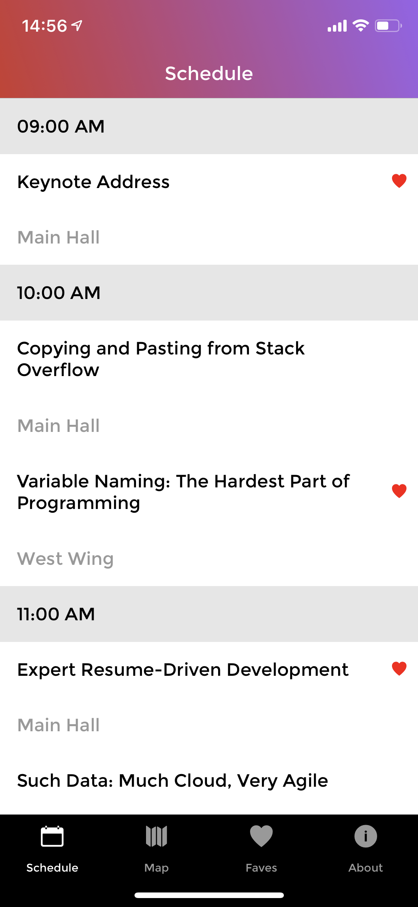
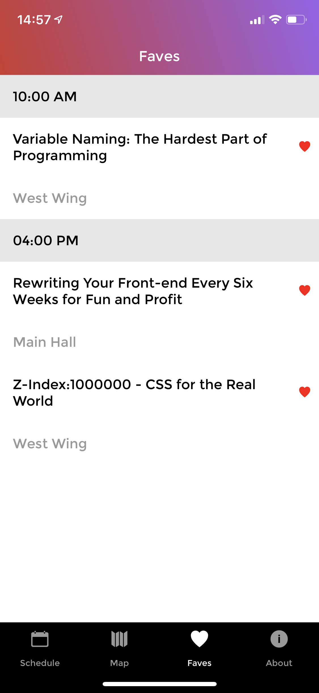
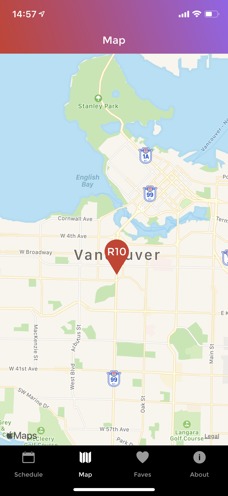
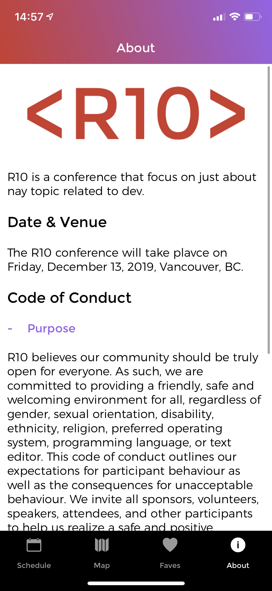

# R10 📱

R10 is a Mobile App build with React Native Technology that can be deployed in both ios and Android platforms.

---

## Screenshot from Mobile

##  

##  

## Description

R10 is a Mobile App to share sessions with repective locations and speakers, where is possible to add any session to your Faves screen and also get more information about the speakers.

## Instalation and run instruction

Download the project, save it in your computer and open the VendingMachine folder in terminal.

## To complete instalation run

```console
$ npm init
```

### Or

```console
$ yarn init
```

### Case you `don't have` neither npm or yarn check the website bellow:

https://www.npmjs.com/get-npm
https://yarnpkg.com/lang/en/docs/install/#mac-stable

### Run

```bash
react-native run-ios
```

### Or

```console
$ react-native run-ios
```

### To run any of those two you first need to have `Xcode` or `Android Studio` installed

---

## Technology involved

- React Native
- GraphQL
- CSS

---

## Personal learnings

How to work with React Native to build a Mobile App that can be customize and deployed Individually for both ios and android platforms.

---

## Author

Alex Faissal
[LinkedIn](https://www.linkedin.com/in/alex-faissal/)
